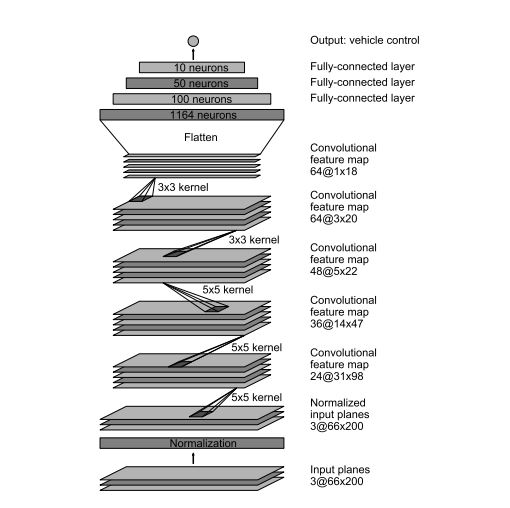

# Udacity Self-Driving Car Engineer Nanodegree - Behavioral Cloning Project

*My solution to the Udacity Self-Driving Car Engineer Nanodegree Behavioral Cloning project.*

**Note: This project makes use of a Udacity-developed driving simulator and training data collected from the simulator (neither of which is included in this repo).**

---

### Files Submitted & Code Quality

#### 1. Submission includes all required files and can be used to run the simulator in autonomous mode

My project includes the following files:
* model.py containing the script to create and train the model
* model.ipynb python notebook containing the code to create and train the model
* drive.py for driving the car in autonomous mode
* model.h5 containing a trained convolution neural network 
* writeup_report.md or writeup_report.pdf summarizing the results

#### 2. Submission includes functional code

Using the Udacity provided simulator and my drive.py file, the car can be driven autonomously around the track by executing 
```sh
python drive.py model.h5
```

#### 3. Submission code is usable and readable

The model.py file contains the code for training and saving the convolution neural network. The file shows the pipeline I used for training and validating the model, and it contains comments to explain how the code works.

---
### Model Architecture and Training Strategy

#### Introduction
The objective of this project is to teach the computer to drive car on on the basis of data collected in simulator provided by Udacity [here](.amazonaws.com/video.udacity-data.com/topher/2016/December/584f6edd_data/data.zip). Here we apply the concepts of Deep Learning and Convolutional Neural Networks to teach the computer to drive car autonomously.

We feed the data collected from Simulator to our model, this data is fed in the form of images captured by 3 dashboard cams center, left and right. The output data contains a file data.csv which has the mappings of center, left and right images and the corresponding steering angle, throttle, brake and speed. 

Using Keras Deep learning framework we can create a model.h5 file which we can test later on simulator with the command "python drive.py model.h5". This drive.py connects your model to simulator. The challenge in this project is to collect all sorts of training data so as to train the model to respond correctly in any type of situation.


### Approach

#### 1. Model and Adjustments

* I decided to test the model provided by NVIDIA as suggested by Udacity. The model architecture is described by NVIDIA [here](https://images.nvidia.com/content/tegra/automotive/images/2016/solutions/pdf/end-to-end-dl-using-px.pdf). As an input this model takes in image of the shape (60,266,3) but our dashboard images/training images are of size (160,320,3). I decided to keep the architecture of the remaining model same but instead feed an image of different input shape which I will discuss later.



### 2. Loading and Preprocessing

*
Final Model Architecture

#### Attempts to reduce overfitting in the model

#### Model parameter tuning

 Creation of the Training Set & Training Process
 
